# Heart Disease Analysis

The analysis and Excel workbook in this repository are licensed under the MIT License. The underlying dataset is sourced from Kaggle and remains subject to its original license and terms.

## Overview

An analysis of heart disease patients using Microsoft Excel. Here I investigated which attributes show a correlation with heart disease.

## Dataset

The data set I used was from Kaggle: https://www.kaggle.com/datasets/johnsmith88/heart-disease-dataset?resource=download

In the original data there were 1025 data points but 723 of them were duplicates, leaving only 302 unique data points.

This data set dates from 1988 and consists of four databases: Cleveland, Hungary, Switzerland, and Long Beach V. It contains 76 attributes, including the predicted attribute, but all published experiments refer to using a subset of 14 of them. The "target" field refers to the presence of heart disease in the patient. I removed the 'ca' attribute (number of major vessels coloured by fluoroscopy) and the 'oldpeak' attribute (ST depression induced by exercise relative to rest) as I didn't use them in my analysis, which brings down the number of columns to 12.

Attribute documentation (12 attributes in total including 'target'):
      
      1 age: age in years

      2 sex: sex (1 = male; 0 = female)
      
      3 cp: chest pain type
        -- Value 1: typical angina
        -- Value 2: atypical angina
        -- Value 3: non-anginal pain
        -- Value 4: asymptomatic
        
      4 restbps: resting blood pressure (in mm Hg on admission to the hospital)
      
      5 chol: serum cholesterol in mg/dl
      
      6 fbs: (fasting blood sugar > 120 mg/dl)  (1 = true; 0 = false)
      
      7 restecg: resting electrocardiographic results
        -- Value 0: normal
        -- Value 1: having ST-T wave abnormality (T wave inversions and/or ST elevation or depression of > 0.05 mV)
        -- Value 2: showing probable or definite left ventricular hypertrophy by Estes' criteria
        
      8 maxhr: maximum heart rate achieved (bpm)
      
      9 exang: exercise induced angina (1 = yes; 0 = no)
     
     10 slope: the slope of the peak exercise ST segment
        -- Value 1: up-sloping
        -- Value 2: flat
        -- Value 3: down-sloping
        
     11 thal: 1 = normal; 2 = fixed defect; 3 = reversible defect
     
     12 target: diagnosis of heart disease; 0 = no disease and 1 = disease.

## Objectives

- Investigate demographic patterns in heart disease
- Analyse relationships between clinical variables and heart disease
- Compare patients with and without heart disease
- Identify notable patterns in the dataset

## Data Cleaning

- I checked for missing values; fortunately there were none.
- I checked for duplicate records; as mentioned above there were 723 duplicates recorded and purged.
- No invalid values recorded
- All data types converted to correct format

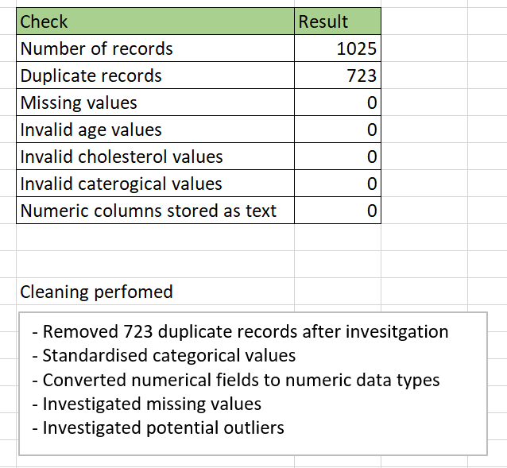

## Exploratory Data Analysis

### Summary

Some points from the summary:
- The average age of patients was lower for patients who have heart disease (51 years old for males and 54.6 years old for females).
- The average resting blood pressure (in mmHg) was only slightly lower for males who had heart disease. They were more or less the same. For females there was a larger difference.
- The average serum cholesterol (in mg/dl) was lower for patients who had heart disease. Also the highest serum cholesterol value recorded for a male (353) was from a patient who did not have heart disease but the highest value recorded for a female (564) was from a patient who did have heart disease. This could suggest that serum cholesterol does not correlate to a patient having heart disease or that it differs for males and females.
- The average maximum heart rate (in bpm) was higher for both sexes for patients who had heart disease. This may suggest that this sample had more patients in lower age groups with heart disease than those without heart disease, as higher maximum heart usually correlates to a younger age. Looking at the average ages for both males and females, we can indeed see that this is the case as the diseased group has lower average ages and that of the non-diseased group.

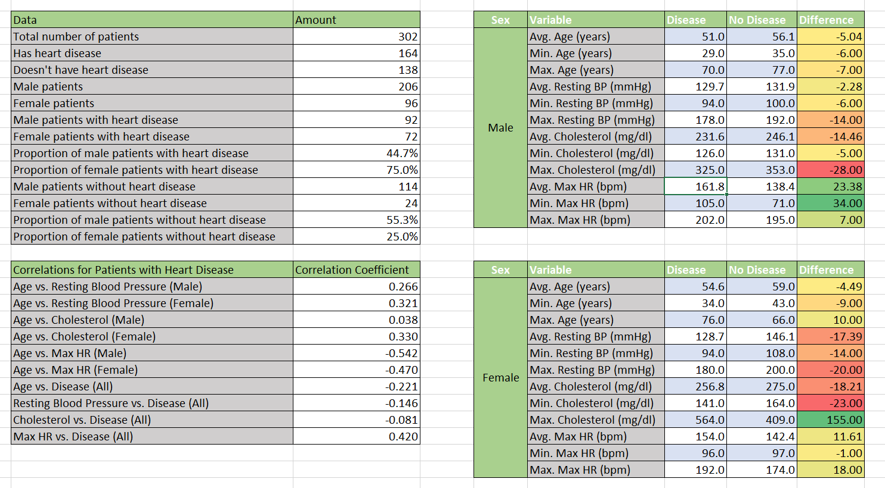

### General Prevalence

54.3% of the patients in this sample had heart disease and 45.7% did not have heart disease.

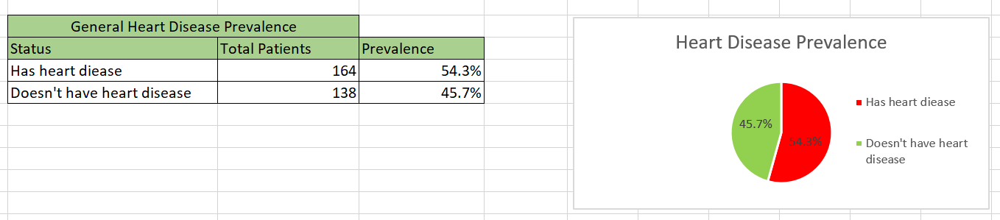

### Age

The most popular age group for heart disease in this sample was the 50-59 group with a share of 41.4%.

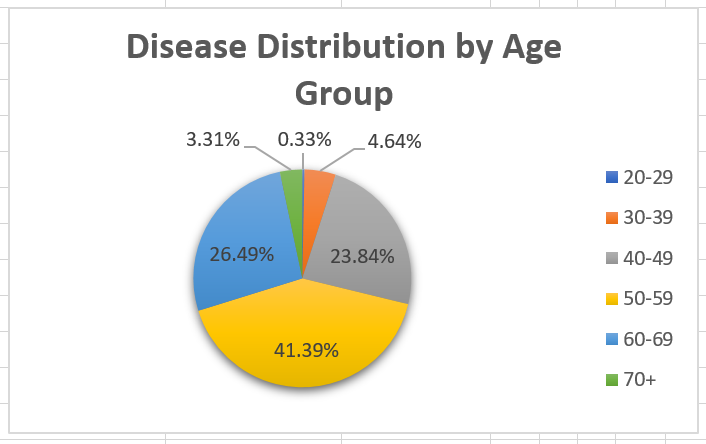

The 20-29 age group has 100% disease prevalence but this is simply due to there not being enough samples from that age group, in fact there's only one patient from that age group and that person happens to have the disease. More data is necessary to draw further conclusions about the prevalence of this age group. Similarly, the 30-39 age group is the next age group with the highest prevalence but this age group also has few samples so I would conclude that the 40-49 age group is in fact the group with the highest disease prevalence from this study. That is, in the 40-49 age group, 69.4% of all patients in this age group have heart disease.

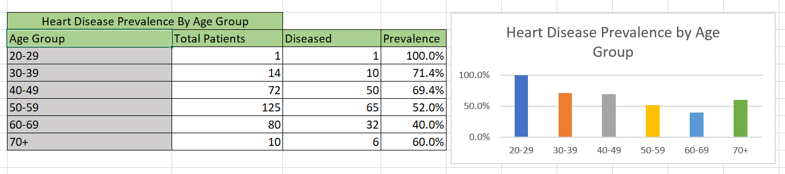

### Sex

There were roughly double the amount of male patients to female patients (after cleaning the data) but I would say that there are still a fair amount of female patients to draw some conclusions. It appears that in this sample, 75% of all female patients have heart disease, whilst only about 45% of male patients have heart disease. This requires further investigation.
 
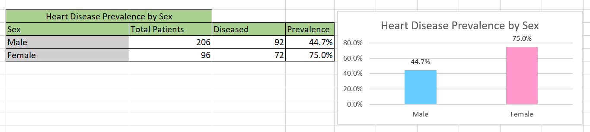

### Chest Pain

Chest-pain type.

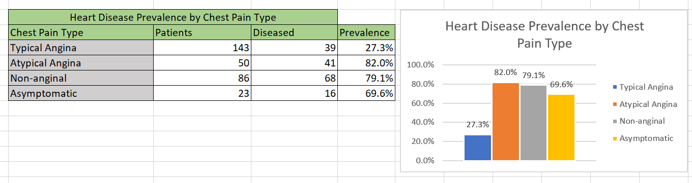

### Resting Blood Pressure

The correlation coefficient of resting blood pressure vs. having the disease was -0.146, suggesting a weak negative correlation. That is, as resting blood pressure increases, a patient tends to not have heart disease.

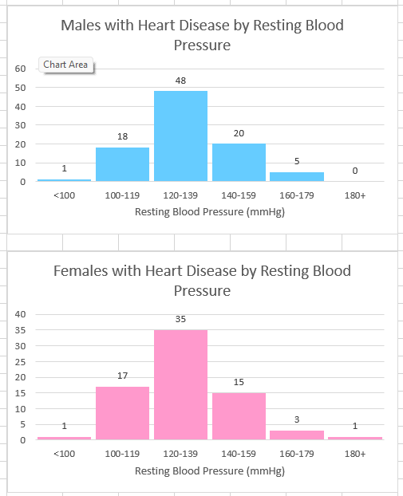

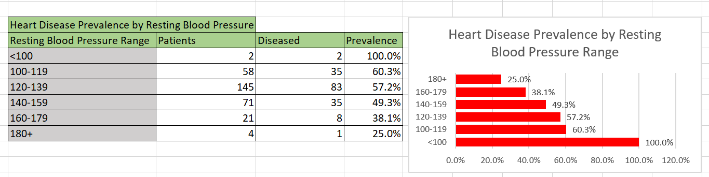

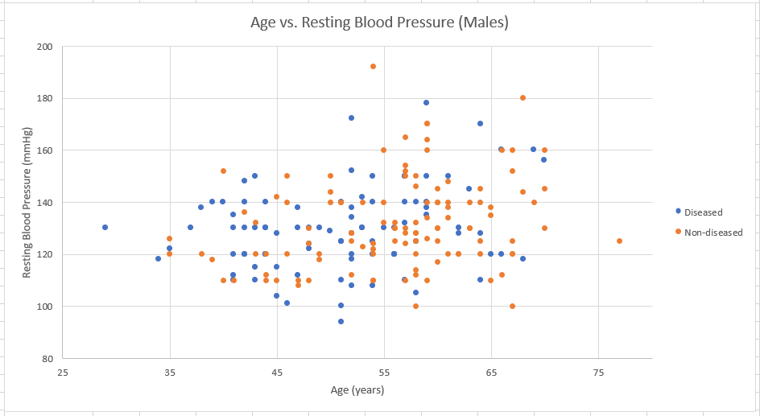

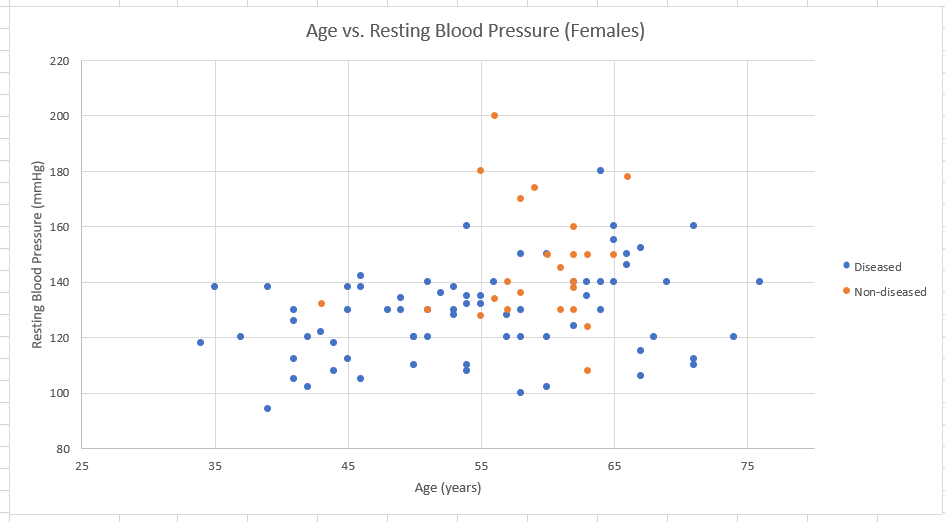

### Cholesterol

The correlation coefficient of serum cholesterol vs. having the disease was -0.081, suggesting a very weak negative correlation. Higher values of the cholesterol are only very slightly associated with a lower likelihood of heart disease in this sample.

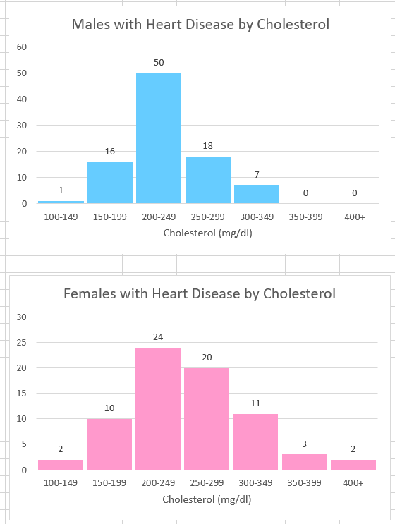

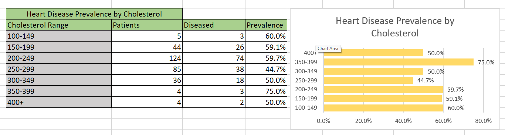

The correlation coefficient for age vs. cholesterol for males was 0.330 which suggests a moderate correlation. Higher ages in males tended to be associated with higher values of serum cholesterol. Compare this with females below.

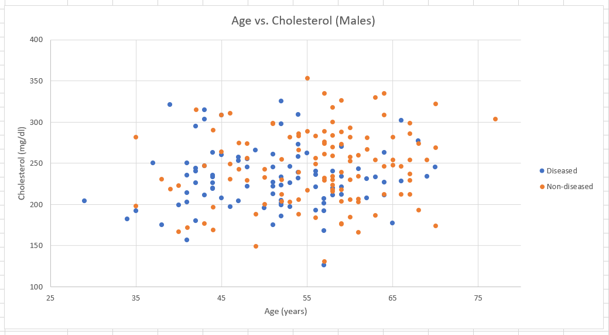

The correlation coefficient for age vs. cholesterol for females was 0.038 which suggests a very weak correlation. Higher ages in females did not tend to be associated with higher values of serum cholesterol (or rather, only very slightly). Compare this with males above.

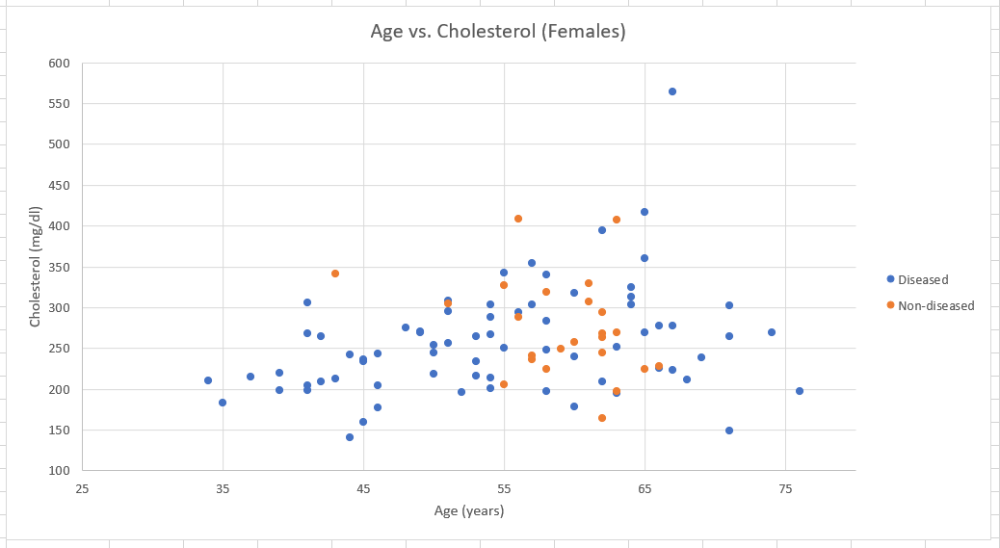

### Fasting Blood Sugar

Explain what you found about fasting blood sugar.

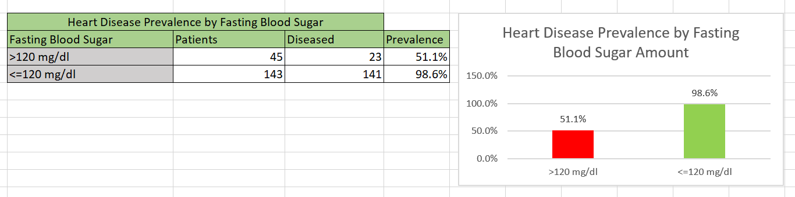

### Resting ECG

Explain what you found about resting ecg type.

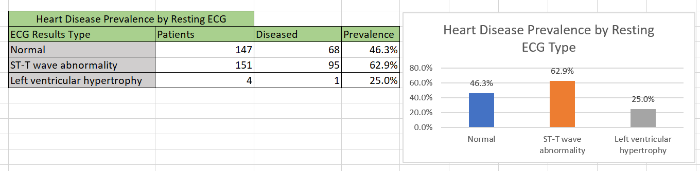

### Max HR

The correlation coefficient of max hr vs. having the disease was 0.420, suggesting a moderate correlation. Higher max hr values tended to be associated with a patient having heart disease in this sample.

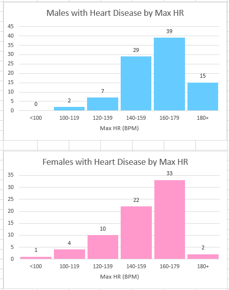

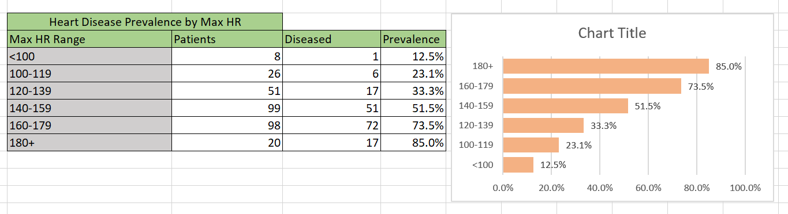

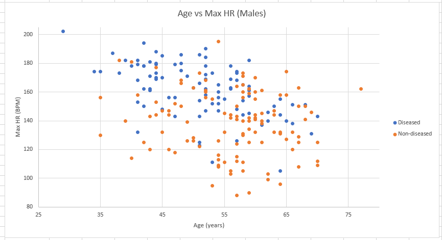

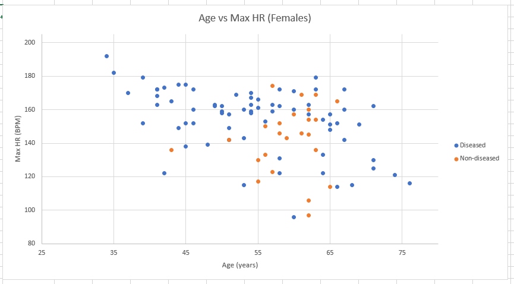

### Exercise Induced Angina

Explain what you found about exercise induced angina.

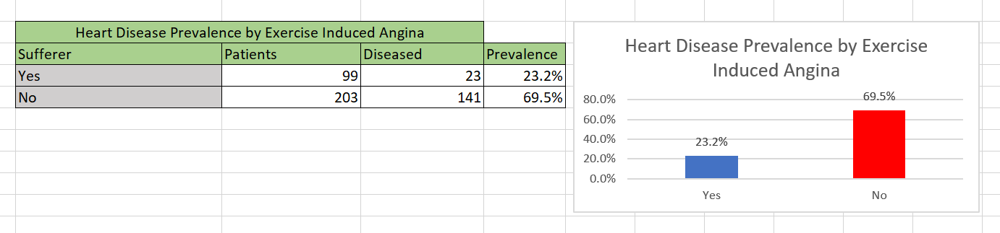

### ST Slope Type

Explain what you found about ST slope type.

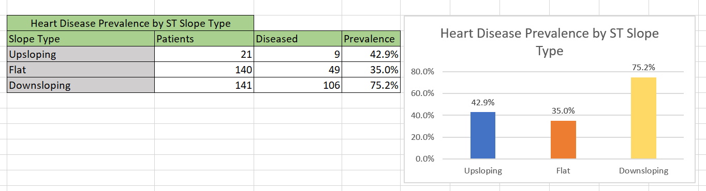

### Thalassaemia Type

Explain what you found about thalassaemia type.

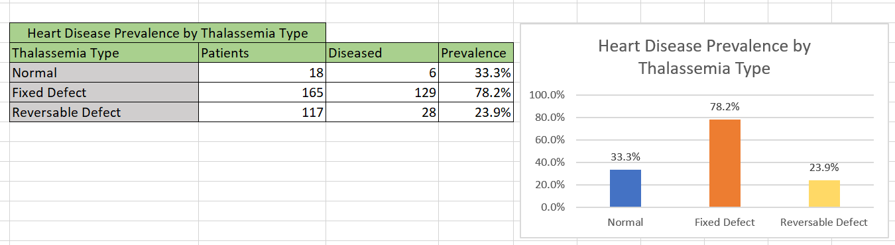

## PivotTable Analysis

Explain how PivotTables were used to investigate relationships between variables.

## Key Findings

1. ...
2. ...
3. ...

## Limitations

- Dataset limitations
- Sample size/composition
- Observational nature of the data
- Association does not imply causation

## Excel Workbook

The complete Excel analysis is available here:

`excel/heart_disease_analysis.xlsx`

## Tools

- Microsoft Excel
- PivotTables
- Excel formulas
- Charts
