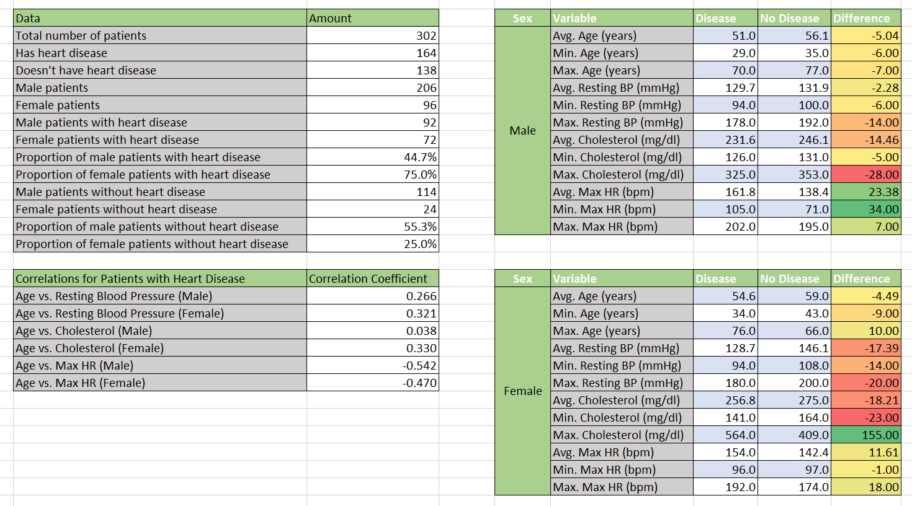

# Heart Disease Analysis

The analysis and Excel workbook in this repository are licensed under the MIT License. The underlying dataset is sourced from Kaggle and remains subject to its original license and terms.

## Overview

An analysis of heart disease patients using Microsoft Excel. Here I investigated which attributes show a correlation with heart disease.

## Dataset

The data set I used was from Kaggle: https://www.kaggle.com/datasets/johnsmith88/heart-disease-dataset?resource=download

In the original data there were 1025 data points but 723 of them were duplicates, leaving only 302 unique data points.

This data set dates from 1988 and consists of four databases: Cleveland, Hungary, Switzerland, and Long Beach V. It contains 76 attributes, including the predicted attribute, but all published experiments refer to using a subset of 14 of them. The "target" field refers to the presence of heart disease in the patient. I removed the 'ca' attribute (number of major vessels coloured by fluoroscopy) and the 'oldpeak' attribute (ST depression induced by exercise relative to rest) as I didn't use them in my analysis, which brings down the number of columns to 12.

Attribute documentation (12 attributes in total including 'target'):
      
      1 age: age in years

      2 sex: sex (1 = male; 0 = female)
      
      3 cp: chest pain type
        -- Value 1: typical angina
        -- Value 2: atypical angina
        -- Value 3: non-anginal pain
        -- Value 4: asymptomatic
        
      4 restbps: resting blood pressure (in mm Hg on admission to the hospital)
      
      5 chol: serum cholesterol in mg/dl
      
      6 fbs: (fasting blood sugar > 120 mg/dl)  (1 = true; 0 = false)
      
      7 restecg: resting electrocardiographic results
        -- Value 0: normal
        -- Value 1: having ST-T wave abnormality (T wave inversions and/or ST elevation or depression of > 0.05 mV)
        -- Value 2: showing probable or definite left ventricular hypertrophy by Estes' criteria
        
      8 maxhr: maximum heart rate achieved (bpm)
      
      9 exang: exercise induced angina (1 = yes; 0 = no)
     
     10 slope: the slope of the peak exercise ST segment
        -- Value 1: up-sloping
        -- Value 2: flat
        -- Value 3: down-sloping
        
     11 thal: 1 = normal; 2 = fixed defect; 3 = reversible defect
     
     12 target: diagnosis of heart disease; 0 = no disease and 1 = disease.

## Objectives

- Investigate demographic patterns in heart disease
- Analyse relationships between clinical variables and heart disease
- Compare patients with and without heart disease
- Identify notable patterns in the dataset

## Data Cleaning

- I checked for missing values; fortunately there were none.
- I checked for duplicate records; as mentioned above there were 723 duplicates recorded and purged.
- No invalid values recorded
- All data types converted to correct format

## Exploratory Data Analysis

### Overwiew

Overview

### General Prevalence

54.3% of the patients had heart disease and 45.7% did not have heart disease.

### Age

Explain what you found about age and heart disease.

### Sex

Explain what you found about sex and heart disease.

### Chest Pain

Explain what you found about chest-pain categories.

### Resting Blood Pressure

Explain what you found about resting blood pressure.

### Cholesterol

Explain what you found about cholesterol.

### Fasting Blood Sugar

Explain what you found about fasting blood sugar.

### Resting ECG

Explain what you found about resting ecg type.

### Max HR

Explain what you found about max heart rate.

### Exercise Induced Angina

Explain what you found about exercise induced angina.

### ST Slope Type

Explain what you found about ST slope type.

### Thalassaemia Type

Explain what you found about thalassaemia type.

## PivotTable Analysis

Explain how PivotTables were used to investigate relationships between variables.

## Key Findings

1. ...
2. ...
3. ...

## Limitations

- Dataset limitations
- Sample size/composition
- Observational nature of the data
- Association does not imply causation

## Excel Workbook

The complete Excel analysis is available here:

`excel/heart_disease_analysis.xlsx`

## Tools

- Microsoft Excel
- PivotTables
- Excel formulas
- Charts
