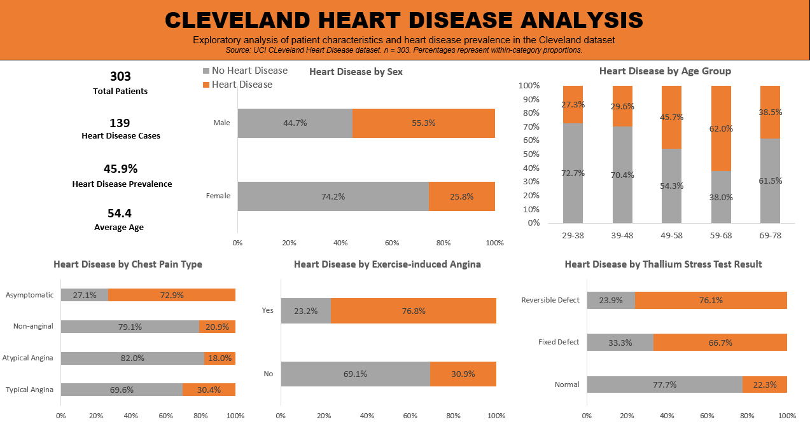

# Heart Disease Analysis

The dataset is sourced from https://archive.ics.uci.edu/dataset/45/heart+disease.

## Overview

An analysis of heart disease patients using Microsoft Excel. Here I investigated which attributes show a correlation with heart disease.

## Dashboard

## Project Objectives

- Clean and prepare the original Cleveland dataset if necessary.
- Explore heart disease prevalence across patient groups.
- Compare categorical and continuous variables.
- Build PivotTables and visualisations.
- Create an interactive Excel Dashboard.

## Key findings

- 45.9% of patients in the dataset were classified as having heart disease.
- Heart disease prevalence was higher among males than females in this sample.
- Asymptomatic chest pain was associated with substantially higher heart disease prevalence.
- Patients with exercise-induced angina showed substantially higher heart disease prevalence.
- Thallium stress test results and ST-slope showed clear differences between disease groups.

These relationships are descriptive associations within the dataset and should not be interpreted as causal effects.

## Files

[Download the Excel workbook](analysis/cleveland_heart_disease_analysis.xlsx)

## Dataset

The original data set dates from 1988 and consists of four databases: Cleveland, Hungary, Switzerland, and Long Beach VA and it contained 76 attributes, including the predicted attribute, but all published experiments refer to using a subset of 14 of them. However, only the Cleveland dataset is complete (303 data points) and processed as the other 3 databases contain missing values. 

The `num` field refers to the presence of heart disease in the patient: it is integer valued from 0 (no presence) to 4. According to the UCI documentation, 0 represents absence of heart disease, while values 1–4 represent presence of heart disease. However, since the UCI documentation does not provide distinct interpretations for values 1–4, the variable was transformed into a binary variable for analysis.

I removed the `ca` field (number of major vessels coloured by fluoroscopy) and the `oldpeak` field (ST depression induced by exercise relative to rest) as I didn't use them in my analysis. I added the `hd` field which is `num` re-encoded into a binary format, which brought the total number of columns to 13.

Attribute documentation:
      
      1 age: age in years

      2 sex: sex (1 = male; 0 = female)
      
      3 cpt: chest pain type
        -- Value 1: typical angina
        -- Value 2: atypical angina
        -- Value 3: non-anginal pain
        -- Value 4: asymptomatic
        
      4 rbp: resting systolic blood pressure (mmHg)
      
      5 chol: serum cholesterol (mg/dl)
      
      6 fbs: fasting blood sugar > 120 mg/dl  (1 = true; 0 = false)
      
      7 restecg: resting electrocardiographic results
        -- Value 0: normal
        -- Value 1: having ST-T wave abnormality (T wave inversions and/or ST elevation or depression of > 0.05 mV)
        -- Value 2: showing probable or definite left ventricular hypertrophy by Estes' criteria
        
      8 maxhr: maximum heart rate achieved (bpm) during exercise
      
      9 exang: patient suffers from exercise-induced angina (1 = yes; 0 = no)
     
     10 slope: the slope of the peak exercise ST segment
        -- Value 1: up-sloping
        -- Value 2: flat
        -- Value 3: down-sloping
        
     11 thal: thallium stress test result indicating myocardial perfusion
        -- 3 = normal
        -- 6 = fixed defect
        -- 7 = reversible defect
     
     12 num: diagnosis of heart disease; 0 = no disease and 1-4 = presence of disease

     13 hd: num attribute re-encoded to a binary format, where 0 is simply the absence of heart disease and 1 is the presence of heart disease in a patient
